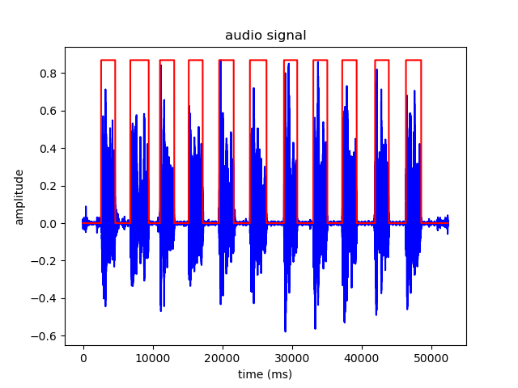

# Voice Activity Detection (VAD)

A simple python version VAD for speech wav file.
It is based on signal energy in frequency band of vocal pitch verse the noise level of silence.

## Clone

- Clone this repo to your local machine using
- $> git clone https://github.com/bangfutao/speech-vad speech-vad
  
## Test

- speech-vad$> python ./speech-vad.py --wavfile ./OSR_uk_000_0051_8k.wav

## Test result

   

## Free samples
- URL: https://www.voiptroubleshooter.com/open_speech/index.html

---
## License

- **[MIT license](http://opensource.org/licenses/mit-license.php)**
